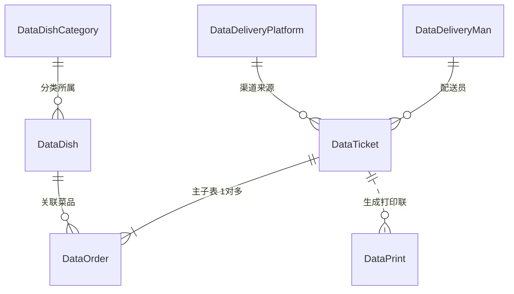

# 餐饮综合管理系统（django-vue / restaurantBeta02）系统架构与业务技术分析

---

## 1. 项目定位与业务背景

本项目（工程名 `restaurantBeta02`，代码库 `django-vue`）是一套专为**海外（主要面向法国/欧洲地区）中餐/亚洲餐厅**定制研发的**一体化智能餐饮管理与调度系统**。
系统深度整合了：
- **前厅点餐收银（POS）**
- **大厅桌台调度（Salle）**
- **后厨出餐看板与菜品聚合调度（KDS / Cuisine）**
- **多渠道外卖聚合与自动接单（Uber Eats / Wix eCommerce / 新微云）**
- **线上预订/订座多端协同与差异比对（TheFork / Wix Table Reservations）**
- **热敏小票异步打印分发（Print Queue 解耦机制）**
- **后厨日常营运与卫生清洁任务管理（Kitchen Cleaning Tasks）**

### 核心本地化与法式合规特性：
1. **法国本地化税务与结算**：
   - 支持法国法定增值税分类：`ticket_tax10`（餐食 10% TVA）、`ticket_tax20`（酒水 20% TVA）及总税额。
   - 支持法国特色支付方式：`pay_by_ticket`（Ticket Restaurant / 饭票）及其张数统计（`ticket_restaurant_count`）。
   - 具备符合欧洲合规标准的 **Z-Rapport（每日营业关账结算）** 状态流转机制。
2. **多语言与编码体系**：
   - 菜品同时维护中文名 `dname` 与法文名 `dfrname`。
   - 所有渠道统一使用中括号助记码（如 `[Q0]`, `[W73]`）进行跨系统菜品自动对齐。

---

## 2. 总体技术栈与工程结构

### 2.1 技术栈
- **后端**：Python 3 + Django 3.1 + Django REST Framework (DRF) 3.11.1
- **数据库**：MySQL（配合 PyMySQL 驱动，并在 `__init__.py` 中伪装版本通过 Django 校验）
- **后台常驻调度**：APScheduler（用于 Wix 独立网店订单自动化轮询）
- **时区标准**：全系统严格锁定 `Europe/Paris`（巴黎时间）
- **前端架构**：
  - 核心管理后台：Vue.js 单页应用（SPA 构建产物位于 `static/js/`, `static/css/` 及 `templates/index.html`）
  - 移动端/平板触控页：原生 HTML5 + CSS Grid + jQuery 3.5.1（大厅桌台 `salle.html`、后厨看板 `test.html`、点餐收银台 `testService.html`）

### 2.2 目录结构解剖
```text
django-vue/
├── restaurantBeta02/               # Django 项目全局配置
│   ├── settings.py                 # 基础配置 (MySQL/CORS/时区/模板)
│   ├── urls.py                     # 全局一级路由
│   ├── asgi.py / wsgi.py           # 服务入口
│   └── __init__.py                 # pymysql 驱动劫持
├── restaurant_beta_02/             # 业务核心 App
│   ├── apps.py                     # 应用启动入口，内置 Wix APScheduler 定时轮询
│   ├── middlewares.py              # 自定义跨域中间件 SimpleCorsMiddleware
│   ├── models.py                   # 11 个数据模型类 (菜品/订单/流水/打印/任务)
│   ├── urls.py                     # 70+ 个业务接口路由 (POS/KDS/第三方对接)
│   ├── views.py                    # 核心业务逻辑控制器与 DRF 序列化器 (2680+行)
│   └── migrations/                 # 23 个迁移版本历史
├── templates/                      # 模板目录
│   ├── index.html                  # 编译后 Vue 管理前端入口
│   ├── salle.html                  # 大厅桌位布局 (CSS Grid 响应式)
│   ├── test.html                   # 厨房出餐 KDS 看板
│   └── testService.html            # 点餐加菜与结账台 (jQuery)
├── static/                         # 静态资源 (Vue 编译 CSS/JS、图标、jQuery)
├── utiles/                         # 离线数据脚本 (备注排列组合运算 scriptInsertDB.py 等)
├── 建表用excel/                     # 历史初始化数据字典与 Excel 表格
├── patchPickupTime.md              # 提餐时间变更协议示例
├── theForkResponse.md              # TheFork 订座报文结构示例
├── uberInMock.md                   # Uber Eats 订单测试 Mock 数据
└── requirements.txt                # 运行依赖
```

---

## 3. 数据模型类详析 (Models)

在 `restaurant_beta_02/models.py` 中，定义了覆盖点餐、后厨、配送与硬件交互的 11 个模型：



| 模型类名 | 对应数据库表 | 业务用途说明 | 核心关键字段 |
|---|---|---|---|
| **DataDishCategory** | `data_dish_category` | 菜品一级/二级分类树 | `category_id`, `subcategory_id` (unique), `category` (类名), `subcategory` (子类名) |
| **DataDish** | `data_dish` | 菜品基础信息与中法文案 | `dcode` (助记码，如 Q0/W73), `dname` (中文), `dfrname` (法文), `dprice` (单价), `dtax` (TVA税率), `dsubcategory` (外键关联分类) |
| **DataTicket** | `data_ticket` | 订单主表（系统核心交易实体） | `ticket_id` (主键如 T1624...), `type` (0堂食/1打包/2外送), `table_num` (桌号或外卖单号L1/L2), `client_name` (嵌第三方单号), `payment_status` (0未付/1中/2已付), `ticket_status` (0预订/1准备中/2完成/3取消/4上菜), `zrapport_condition` (0未日结/1已日结), `ticket_price` (总价), `ticket_discount` (折扣), `ticket_reduction` (满减优惠), 多种支付方式细分 (`pay_by_cash`, `pay_by_card`, `pay_by_ticket` 等), 法国 TVA 细分 (`ticket_tax10`, `ticket_tax20`, `ticket_tax`), 送餐平台与送餐员外键 |
| **DataOrder** | `data_order` | 订单单品菜品明细流水 | `order_id` (D+时间戳+随机数), `tid` (外键关联 Ticket), `code` (外键关联 Dish), `quantity` (数量), `o_note` (忌口备注), `prepare_status` (0预订/1准备中/2备齐/3完成/4上菜), `is_served` (上菜标记), `emergency` (0优先/1普通/2延后) |
| **DataDeliveryPlatform** | `data_delivery_platform`| 外送合作平台字典 | `platform_id`, `platform_code`, `platform` (Uber/Wix/新微云等), `platform_commission` (抽成比例) |
| **DataDeliveryMan** | `data_delivery_man` | 送餐员基础档案 | `delivery_man_id`, `delivery_man_code`, `delivery_man_name` |
| **DataNoteBase** | `data_note_base` | 基础口味/要求备注库 | `id`, `note_category`, `note_content` (如微辣、少盐、不要香菜) |
| **DataSpecialNote** | `data_special_note` | 复合备注字典 | `note_id`, `note`, `component` (由基础备注组合生成的复合选项) |
| **DataPrint** | `data_print` | 异步热敏打印任务队列表 | `print_id`, `print_type` (0厨房/1吧台前厅/2黄色存根/5外卖单), `print_content` (小票打印格式化文本或序列化 JSON) |
| **DataKitchenCleaningTask**| `data_kitchen_cleaning_task`| 厨房日常卫生清洁排班任务 | `task_name`, `task_manager`, `task_duration`, `task_frequency`, `last_completed_time`, `completion_history`, `task_status` |
| **NoteTest** | `note_test` | 测试与开发临时模型 | `note_id`, `note`, `component` |

---

## 4. 核心业务流程与功能模块

### 4.1 堂食与外卖收银业务（POS）
- **挂单与开台**：通过 `/testservice/{桌号}` 进入点餐台，选择菜品、人数及特殊要求。
- **结账与日结**：
  - 支持现金、银行卡、法国餐券（Ticket Restaurant）、微信/支付宝混合支付。
  - 会计日终通过 `/testpatchticket/` 执行 **Z-Rapport 日结关账**（`zrapport_condition=1`）。
  - 日结完成后，归档至历史报表，新营业周期不受干扰。

### 4.2 后厨出餐聚合调度系统（KDS）
- 突破传统单张小票的离散管理方式，通过 `/testdishordergroupby2/` 与 `/testdishordergroupby3/` 实现**菜品智能聚合**：
  - 按菜品子类别与菜品代码分组，使用 Django `Sum('quantity')` 汇算待做总量。
  - 按优先级排序（`emergency`: 优先 > 普通 > 延后），大厨一锅炒出同名菜，显著提升后厨吞吐率。

### 4.3 自动化外部渠道集成（Integrations）

```mermaid
flowchart TD
    subgraph 外部生态
        WixStore[Wix 网店订单]
        WixBook[Wix 订座平台]
        TheFork[TheFork 订座平台]
        UberEats[Uber Eats 外卖]
    end

    subgraph 系统后端
        APSched[APScheduler 轮询调度器 (apps.py)]
        SyncFork[/testtheforksync/ 接口]
        UberIn[/testuberin/ 接口]
        OrderEngine[订单引擎 / 防重解析]
        MySQL[(MySQL 数据库)]
        PrintQueue[DataPrint 打印队列]
    end

    WixStore -->|每分钟轮询| APSched
    APSched --> OrderEngine
    TheFork -->|批量推单| SyncFork
    SyncFork -->|增量 Patch| WixBook
    UberEats -->|Webhook| UberIn
    UberIn --> OrderEngine
    OrderEngine -->|事务落库| MySQL
    OrderEngine -->|on_commit 异步投递| PrintQueue
```

1. **Wix 商城自动同步 (`apps.py`)**：
   - 内置 APScheduler 定时每 60 秒轮询 Wix eCommerce API。
   - 过滤订座虚拟商品，自动识别菜品助记码 `[dcode]`。
   - 采用 `transaction.atomic()` 与 `client_name__endswith` 幂等防重机制。
   - 自动生成 `L{n}` 配送编号，并通过 `transaction.on_commit` 向 `DataPrint` 发送打印任务。
2. **TheFork 订座双向同步 (`TestTheForkSyncView`)**：
   - 接收 TheFork 预订数据，附加 `(叉子订位)` 前缀与 `THEFORK_SOURCE_ID` 追踪标识。
   - 具有高度完善的差异比对（Diff）算法，自动检测客人姓名、人数、到店/离店时间、取消状态变更，并增量同步给 Wix 预订系统。
3. **Uber Eats 外卖接单 (`TestUberInView`)**：
   - 接收标准推单数据，解析是否需要餐具（在姓名尾部标 `√` 或 `X`）。
   - 计算满减优惠：根据菜品原价与实付总价差额自动反算并保存 `ticket_reduction`。
   - 自动推入打印队列。
4. **小票打印异步队列 (`DataPrint`)**：
   - 业务接口无需直连物理小票打印机，通过向 `DataPrint` 写入任务记录，由打印客户端常驻脚本异步拉取并清空，彻底防止打印机卡纸或断网阻塞业务服务。

---

## 5. 核心 API 路由索引表

| 路由地址 | 方式 | 业务职责说明 |
|---|---|---|
| `/testcategory/` | GET | 获取一级菜品类别列表 |
| `/testsubcategory/` | GET | 获取二级菜品子类别列表 |
| `/testdish/{category_id}/` | GET | 根据类别获取在售菜品 |
| `/testalldish/` | GET | 获取全量菜品列表 |
| `/testticket/{table_num}/` | GET | 根据桌号反查当前订单及菜品明细 |
| `/testticketlistnopaied/` | GET | 获取所有未结账的挂单（堂食/打包/外送） |
| `/testticketlistpaied/` | GET | 获取所有已结账的历史订单 |
| `/testpatchticket/{ticket_id}/` | PATCH/PUT | 更新订单支付方式、金额明细、结账及日结状态 |
| `/testdishordergroupby2/{mode}/`| GET | **后厨配餐聚合看板数据**（汇总未出菜品与各桌明细） |
| `/testdishordergroupby3/{mode}/`| GET | **前厅传菜聚合看板数据**（出菜监控） |
| `/testprintlist/` | GET/POST | 获取未处理打印队列 / 写入打印任务 |
| `/testwixonlineorders/` | GET | 查询与调试 Wix 在线网店订单数据 |
| `/testwixautosyncswitch/` | GET/POST | 查询/开启/关闭 Wix 自动同步后台轮询开关 |
| `/testwixreservations/` | GET/POST | Wix 桌位预订列表查询与新增 |
| `/testwixreservations/{pk}/` | GET/PATCH | Wix 桌位预订详情查询与状态更新 |
| `/testtheforksync/` | POST | **TheFork 订座数据同步引擎**（自动增量同步至 Wix） |
| `/testuberin/` | POST | **Uber Eats 外卖推单接收**（自动落库与打印） |
| `/testpatchpickuptime/` | POST | 外卖提餐时间变更补丁更新接口 |
| `/kitchencleaningtasklist/` | GET/POST | 厨房清洁与 HACCP 任务列表及打卡 |
| `/testbasenote/` | GET/POST | 基础口味/做法备注词库管理 |

---

## 6. 系统架构总结与后续优化建议

### 6.1 架构亮点
1. **多生态统一收口**：将 Wix、Uber Eats、TheFork 等欧洲主流餐饮服务深度整合进单一数据模型体系，极大降低餐厅多端对账成本。
2. **后厨高效配菜设计**：创新的菜品 Groupby 汇总机制，让后厨从“按单配菜”升级为“按菜批量配餐”。
3. **硬件解耦高可用**：数据库级别的打印任务缓冲设计，保障了弱网与断纸极端情况下的服务健壮性。

### 6.2 建议优化方向
1. **敏感凭证抽离（环境配置化）**：
   - 现代码中硬编码了 Wix API 密钥、Site ID、新微云 Cookie 以及 MySQL 本地密码，建议统一收拢至 `.env` 环境变量文件。
2. **大文件视图分层重构**：
   - 当前 `restaurant_beta_02/views.py` 超过 2600 行，建议后续拆分为 `views/pos.py`、`views/kds.py`、`views/wix.py`、`views/thefork.py`、`views/uber.py`。
3. **接口路由规范化**：
   - 历史迭代保留了较多 `test*` 前缀接口（如 `testticket`、`testdish`），建议规划标准化 RESTful 路由映射（如 `/api/v1/tickets/`）。
4. **定时任务分布式演进**：
   - 目前 Wix 轮询使用进程内 APScheduler，多 worker 部署下建议抽离为独立的 Celery Beat 或 Docker 独立定时服务。
